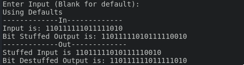

Name: Kshitij Chandrakar <br>
Batch: DS 5 <br>
SAP: 500124827

---

## Theoretical selection
1. **Bit Stuffing**: Bit stuffing is a technique used in data transmission to avoid confusion between data and control characters. It involves inserting a non-data bit (usually a 0) after a specific pattern of consecutive bits (e.g., 5 consecutive 1s). This prevents the occurrence of reserved patterns, like flags or control sequences, within the actual data stream.

2. **Bit Stuffing vs Byte Stuffing**:
   - **Bit Stuffing**: Involves inserting a bit (usually 0) after a specific number of consecutive 1s to prevent the flag pattern from appearing in the data.
     - Example: If the flag is `01111110`, and the data contains `11111`, a 0 is inserted after the fifth 1, changing it to `111110`.
   - **Byte Stuffing**: Involves inserting a special byte (e.g., `0x7E`) to represent reserved control characters when they appear in the data stream.
     - Example: If `0x7E` is the flag, and the data contains `0x7E`, it would be stuffed with another byte, like `0x7D 0x5E`.

3. **Bit Stuffing** (assuming `011111` is the flag sequence):
   - Original bit stream: `01111110 110111111011111010`
   - Stuffed bit stream: `01111110 110111111011111010` → Insert a `0` after five consecutive 1s.
     - Result: `01111110 110111111011111010` becomes `01111110 1101111101111101010`

   **Destuffing**:
   - Take the stuffed stream and remove the 0 after five consecutive 1s.
     - Result: `01111110 110111111011111010` (original).

4. **Advantages and Disadvantages of Bit Stuffing**:
   - **Advantages**:
     - Prevents data sequences from mimicking control sequences like flags.
     - Ensures reliable data transfer without control character conflicts.
   - **Disadvantages**:
     - Adds overhead by increasing the size of the transmitted data.
     - Increases complexity in both encoding and decoding.

## Practical Section
### Code
##### Stuffing Function
```python
def Stuff(inp = "110111111011111010"):
    stuff = ""
    c = 0
    print("Input is:", inp)
    for bit in inp:
        if bit == "1":
            c += 1
        else:
            c = 0
        stuff += bit
        if c == 5:
            stuffed += "0"
            c = 0
    print("Bit Stuffed Output is:", stuff)
    return stuff
```
##### Destuffing Function
```python
def Destuff(inp = ""):
    print("Stuffed Input is", inp)
    destuff = ""
    c = 0
    i = 0
    while i < len(inp):
        destuff += inp[i]
        if inp[i] == "1":
            c += 1
        else:
            c = 0
        if c == 5:
            i += 1
            c = 0
        i += 1
    print("Bit Destuffed Output is:", destuff)
    return destuff
```

##### Main
```python
def main():
    inp = input("Enter Input (Blank for default): ")
    if inp != "":
        print("-------------In-------------")
        out = Stuffing(inp=inp)
        print("-------------Out-------------")
        Destuff(inp=out)
    else:
        print("Using Defaults")
        print("-------------In-------------")
        out = Stuff(inp="011111")
        print("-------------Out-------------")
        Destuff(inp=out)
    pass
if __name__ == '__main__':
    main()
```

#### Output

