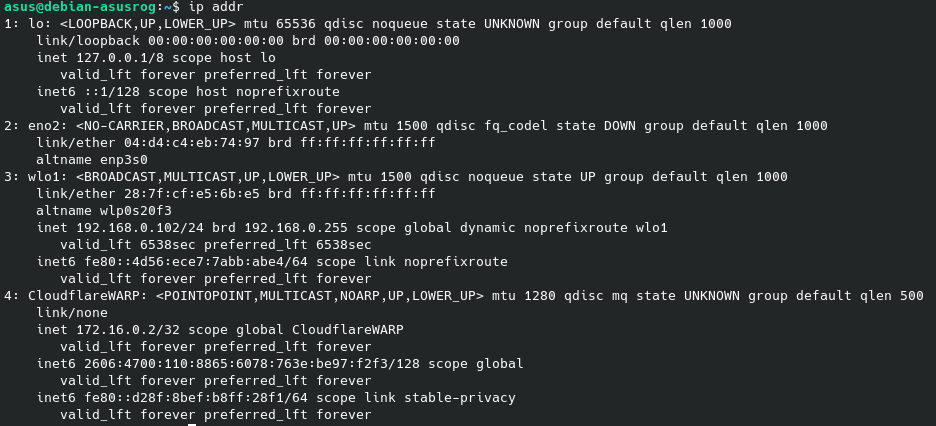
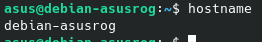
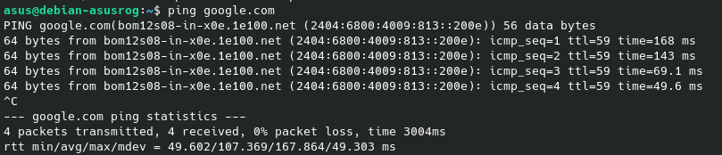
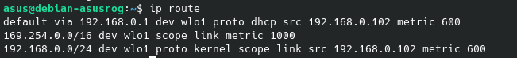
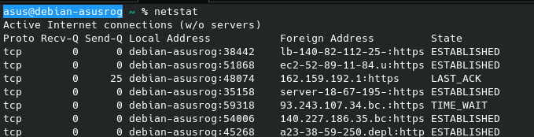
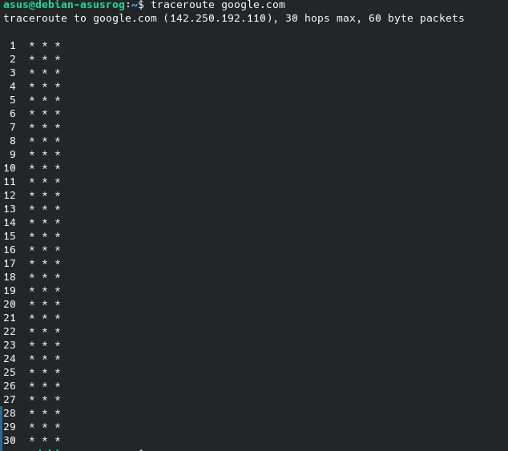
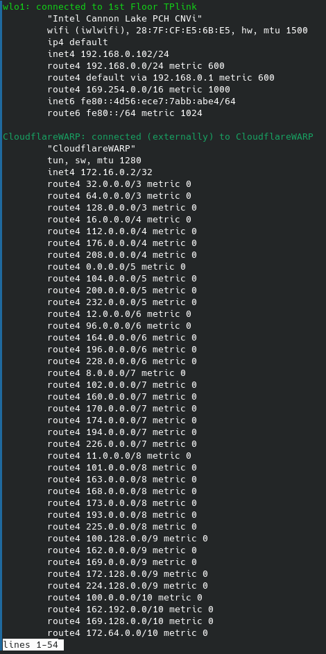
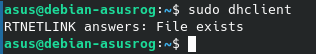
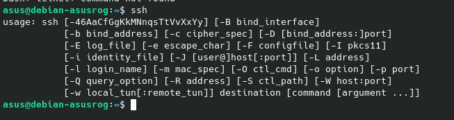
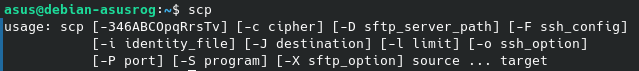

# Assignment 5
---
SAP: 500124827 
Name: Kshitij Chandrakar 
Batch: 5

---
**ifconfig:** Deprecated, would not run on my machine but displays information about the connected networks.
**ip addr:** Displays information about the connected networks.

**hostname:** displays the hostname of the machine. 

**ping:** pings the given address

**ip route:** Shows the route a given packet takes.

**netstat:** Print  network  connections, routing tables, interface statistics, masquerade connections, and multicast memberships

**traceroute:** Shows the route a given packet takes.

**nmcli:** cli tool to manage the network.

**dhclient:** a tool to manage network interfaces using DHCP.

**ssh:** used to ssh into other machines using the ssh protocol

**scp:** Secure File Copy over SSH in a given network.

